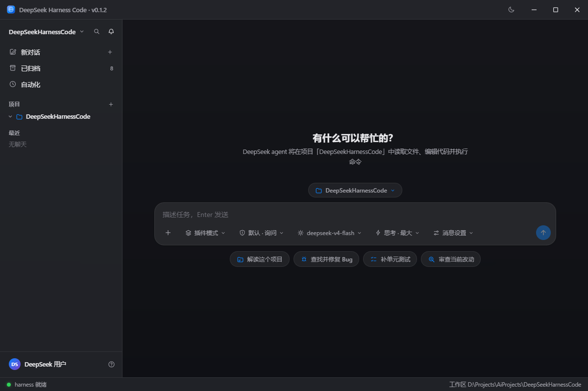
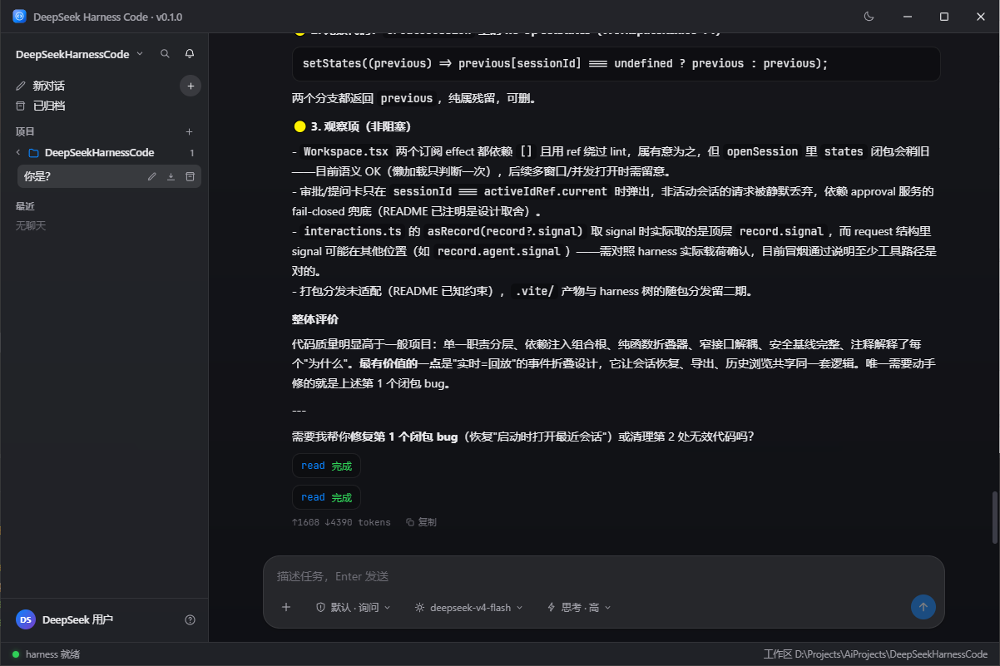
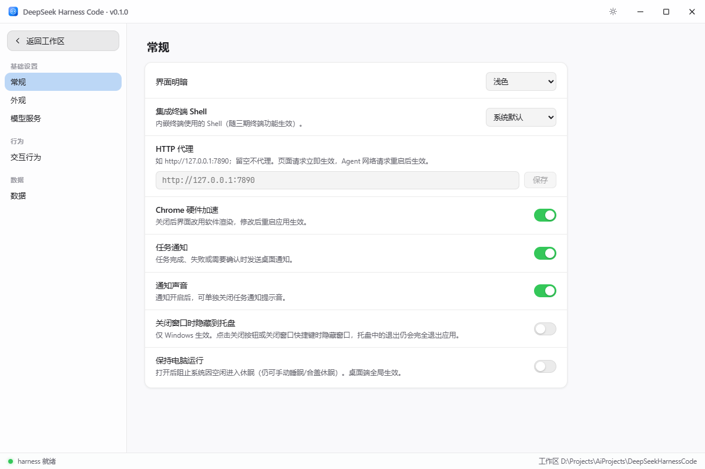

# DeepSeek Harness Code

[]()
[]()
[]()
[]()

类 zcode / Codex 的 **桌面 GUI AI 开发客户端**（Electron + React），LLM 核心进程内嵌
[deepseek-harness](./deepseek-harness)（`dsh`，Cordis 插件化 agent harness）——
**只增量封装，不修改 harness 任何源码**。

## 界面预览

| 深色主题 · 对话 / 工具卡片 | 浅色主题 |
|---|---|
|  |  |

设置页（模型服务 / API Key / 多供应商）：



## 能力（一期）

- 会话管理：列表 / 新建 / 历史加载 / 跨启动恢复（事件溯源日志回放）
- 流式对话：正文 markdown + 可折叠思考过程 + token 用量
- 工具可视化：pwsh / read / write / edit / glob / grep / str_replace_editor 工具卡片
- 人机协作：变更类工具审批（允许一次 / 拒绝）、`ask_user_question` 交互卡片
- 控制：停止运行中的回合、运行中插话（steer）
- 设置：API Key（凭据文档）、默认模型、baseURL、思考模式

## 能力（二期）

- **任务面板**：折叠 `todo/write` 快照（整表替换语义），进度条 + 待办/进行中/已完成三态
- **edit diff 视图**：`str_replace_editor` 的 str_replace / create / insert 渲染为
  增删行双色块（浅深色主题各自配色），摘要行直接显示目标文件路径
- **会话重命名**：本地别名（localStorage，叠加在 `session/title` 之上；双击侧栏条目或 ✎）
- **会话导出**：折叠态转 Markdown（思考/工具/用量齐全），系统保存对话框落盘
  （`app:export-text` IPC，文件名自动清洗）
- **浅色 / 深色主题**：完整 CSS token 双主题（`<html data-theme>`），跟随系统 / 手动切换
  （标题栏快捷切换 ☀/☾），`color-scheme` 联动原生控件与滚动条
- **字体自定义**：内置 **JetBrains Mono 2.304**（OFL）为等宽默认（代码块 / 工具卡 /
  diff / 输入区）；界面字体、等宽字体、字号可在设置中替换为任意本机字体或自定义字体名
- **无边框窗口**：去除系统默认标题栏，自绘标题栏（拖拽移动、双击最大化、
  Segoe Fluent 窗口控件、最大化状态实时同步）

## 能力（三期）

- **多供应商多 Key**（Cherry Studio 建模）：`providers.json` 管理多个
  OpenAI 兼容供应商（baseURL / 模型目录 / 思考档位），每供应商多 Key
  轮询；明文 Key 永不进入渲染层（快照仅 masked）
- **Agent 权限模式**：`ask`（默认审批）/ `full`（完全访问）/ `plan`
  （计划模式，变更类工具直接拒绝）——完全映射 harness 原生审批与
  plan-mode 插件，输入区工具栏一键切换
- **聊天 UI 改版**：Cherry 风格消息布局（助手左头像无底色 / 用户右侧
  气泡）、Composer 工具栏胶囊菜单（模型 / 思考强度 / 权限模式）、
  中性灰阶全局 token
- **数据目录迁移**：全部数据集中 `~/.deep-seek-harness-code/`
  （`DSHC_HOME` 可覆盖；旧 userData 自动一次性迁移），内含
  app-settings / providers / dsh-home（会话与凭据）/ cache

## 架构

```
Electron 主进程（ESM .mjs，vite 打包）
 ├─ harness/paths.ts           DSH_HOME / 工作区 / harness 根路径
 ├─ harness/harness-service.ts boot() 胶水 + 会话代理 + 设置/凭据 + 状态机
 ├─ harness/interactions.ts    审批瀑布应答器 + 工具审批门 + 提问 provider
 ├─ ipc/*                       白名单 IPC 通道（invoke + 事件推送）
 preload（CJS，sandbox）        contextBridge 白名单桥
 渲染层（React SPA，无直接网络）
 ├─ components/                 侧栏 / 对话流 / 任务面板 / diff / 输入区 / 审批卡 / 设置
 ├─ state/sessionStore.ts       SessionEvent → UI 状态纯函数折叠（实时=回放）
 ├─ state/appearance.ts         主题/字体偏好（localStorage → <html> token）
 └─ state/sessionNames.ts       会话本地别名（重命名覆盖层）
```

**与 harness 的集成方式**：主进程以绝对 file URL 动态加载
`deepseek-harness/packages/boot/app-boot/lib/index.js` 的 `boot()`，以
`config/harness/cordis.yml` 为配置入口（插件用**相对路径直连** harness 构建产物，
绕过包管理器解析）。subprocess 服务由自写插件 `subprocess-child`
（`src/harness-plugins/` → 编译到 `config/harness/plugins/`）以纯 child_process 实现，
避免 node-pty 在 Electron 内的原生 ABI 不匹配。

数据落位：`DSHC_HOME`（默认 `~/.deep-seek-harness-code`，可用环境变量覆盖）
内含 app-settings.json / providers.json / dsh-home/
（settings.yaml / .credentials.yaml / sessions/）；`DSH_HOME` 指向其中
dsh-home，旧 userData 数据启动期自动迁移。

## 快速开始

前置：Node ≥ 22.19（或 ≥24）、pnpm ≥ 11、Windows（shell 工具走 pwsh）。

```powershell
# 1) harness 子树依赖（首次或迁移目录后必须；链接是绝对路径）
cd deepseek-harness
pnpm install --ignore-scripts

# 2) 客户端依赖与启动
cd ..
npm install
npm start          # electron-forge start（渲染层 HMR；主进程改动需重启）
```

启动后右上角 ⚙ 设置里填入 DeepSeek API Key 即可对话。

## 常用命令

| 命令 | 说明 |
|---|---|
| `npm start` | 开发运行（forge + vite dev server） |
| `npm run typecheck` | 全量 TS 项目引用检查（含 harness 插件编译） |
| `npm test` | vitest 单测（事件折叠 / markdown 渲染） |
| `npm run build:harness` | 仅编译自写 harness 插件 |
| `npm run dist` | 打包发布 zip 到 `release/`（见下节） |
| `node scripts/smoke-harness.mjs` | headless 冒烟：boot → 对话 → 持久化 → 恢复 |
| `SMOKE_TOOL=1 node scripts/smoke-harness.mjs` | 工具+审批冒烟（pwsh 真实执行） |

冒烟测试用 harness 自带的 mock LLM（无需 API Key）：

```powershell
cd deepseek-harness
# 基础对话 mock（端口 18971）
node --import tsx packages/test-support/llm-mock-server/src/bin.ts --port 18971 `
  --sequence success --success-text "冒烟回复 OK" --repeat-last
# 另开终端，指向 mock
$env:DEEPSEEK_BASE_URL = "http://127.0.0.1:18971/v1"; node scripts/smoke-harness.mjs

# 工具+审批 mock（端口 18972）
node --import tsx packages/test-support/llm-mock-server/src/bin.ts --port 18972 `
  --sequence tool_call_success,success --repeat-last --tool-name pwsh `
  --tool-arguments '{"command":"Write-Output smoke-ok","description":"run smoke command"}'
$env:DEEPSEEK_BASE_URL = "http://127.0.0.1:18972/v1"; $env:SMOKE_TOOL = "1"
node scripts/smoke-harness.mjs
```

（开发客户端本体也可在设置页把 baseURL 指到 mock 验证 UI 流。）

## 打包发布（v0.1.0，Windows）

```powershell
npm run dist
# 产物：release/deepseek-harness-code-v0.1.0-win-x64.zip
```

发布 zip 的组成与首次运行方式：

- `electron-forge package` 产物（`asar: false`），客户端本体与原生依赖已随包；
- `config/harness/`（cordis.yml + 自写插件）与 `deepseek-harness/` 源码 +
  **已构建的 lib 产物**拷入 `resources/app/`，运行时路径解析与开发形态完全一致；
- harness 的 `node_modules`（pnpm 工作区，体量大）不进包：解压后先执行一次
  **`setup.cmd`**，在包内 `deepseek-harness/` 执行
  `pnpm install --ignore-scripts --prod` 重建生产依赖（需 Node.js ≥ 22 与 pnpm），
  之后双击 `deepseek-harness-code.exe` 即可使用。

## 开源信息

- 作者：[逆流无邪](https://github.com/sgs844575)
- 仓库：<https://github.com/sgs844575/deepseek-harness-code>
- 协议：[MIT](./LICENSE)；内嵌的 [deepseek-harness](./deepseek-harness)
  （MIT）与 JetBrains Mono 字体（SIL OFL 1.1）分属各自协议
- 当前版本：v0.1.0

## 目录速览

```
config/harness/cordis.yml        # agent 组合（挂哪些官方插件 + 自写插件）
src/harness-plugins/             # 自写 cordis 插件源码（subprocess-child）
src/main/harness/                # boot 胶水 / 服务 / 交互桥
src/{preload,shared,renderer}/   # 桥 / 契约 / React UI
scripts/smoke-harness.mjs        # headless 集成冒烟
```

## 如何扩展

- **新增 IPC 能力**：`src/shared/channels.ts` 加通道 → `bridge.d.ts` 加方法 →
  preload 实现 → 对应 `src/main/ipc/*-handlers.ts` 注册。
- **调整 agent 工具集**：改 `config/harness/cordis.yml`（增删官方插件行；
  参照 `deepseek-harness/packages/bundle/base/cordis.patch.yml`）。
- **新增自写 harness 插件**：源码放 `src/harness-plugins/<name>/`，
  在 cordis.yml 以 `./plugins/<name>/index.js` 相对路径挂载。

## Roadmap（未实现，仅记录）

子代理视图（`subagent.*`，事件在子会话日志中，需跨会话聚合）· 会话 fork ·
内嵌终端（需 node-pty Electron 重建或自写 PTY）· 沙箱栈与权限模式切换
（koffi / pwsh-sandbox / permission-presets）· skills / MCP · 多工作区多窗口 ·
安装器形态分发（当前为 zip + setup.cmd 免安装形态）· macOS / Linux 适配 · i18n。

## 已知约束

- `deepseek-harness` 为 0.1.0-rc.5（pre-1.0），本项目通过 `src/main/harness/harness-context.ts`
  的窄接口消费，harness 升级时只需对齐该文件。
- vendored harness 树携带**已构建的 lib 产物**（其源码仓库的 `.gitignore`
  排除 `lib/`，本项目以 `git add -f` 强制纳入），克隆后无需再构建 harness。
- 打包为免安装 zip（`asar: false` + setup.cmd 重建 harness 生产依赖），
  未提供安装器与代码签名。
