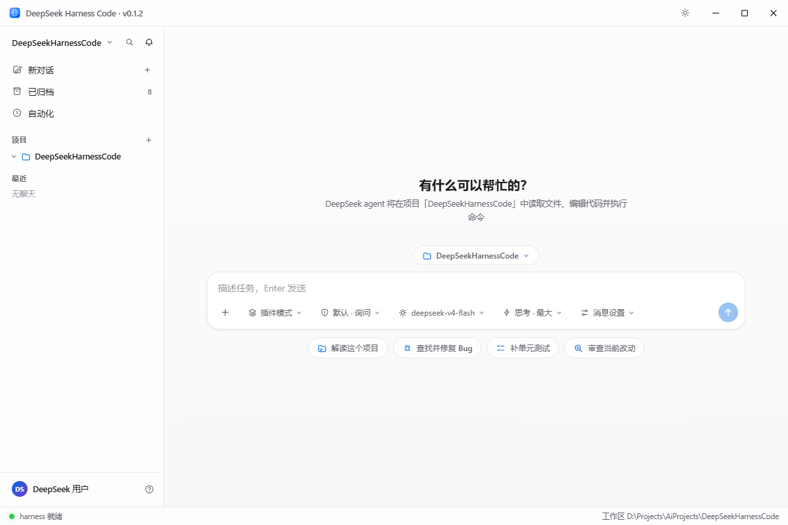
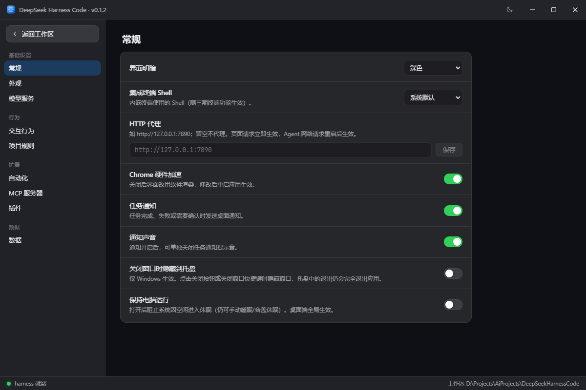

# DeepSeek Harness Code

[]()
[]()
[]()
[]()

类 zcode / Codex 的 **桌面 GUI AI 开发客户端**（Electron + React），LLM 核心进程内嵌
[deepseek-harness](./deepseek-harness)（`dsh`，Cordis 插件化 agent harness）——
**只增量封装，不修改 harness 任何源码**。

## 界面预览

| 深色主题 · 对话 / 工具卡片 | 浅色主题 |
|---|---|
|  |  |

设置页（模型服务 / API Key / 多供应商）：



## 能力概览

- 会话管理：多项目分组侧栏 / 新建 / 重命名 / 派生（fork）/ 导出 / 归档 / 跨启动恢复（事件日志回放）
- 对话流：流式 markdown + 可折叠思考过程 + 工具时间线（diff / 参数 / 结果）+ 子代理卡片
- 多供应商多 Key（Cherry Studio 建模）+ Agent 预设（插件 / 标准 / PTC / 极简 / 创造）
- MCP 服务器 / 项目规则 AGENTS.md / 自动化定时任务 / 斜杠命令面板 / 附件上传
- 权限模式（询问 / 完全访问 / 计划模式）与命令沙箱（实验）

各期完整能力清单见 [docs/CAPABILITIES.md](./docs/CAPABILITIES.md)。

## 架构

```
Electron 主进程（ESM .mjs，vite 打包）
 ├─ harness/paths.ts           DSH_HOME / 工作区 / harness 根路径
 ├─ harness/harness-service.ts boot() 胶水 + 会话代理 + 设置/凭据 + 状态机
 ├─ harness/interactions.ts    审批瀑布应答器 + 工具审批门 + 提问 provider
 ├─ ipc/*                       白名单 IPC 通道（invoke + 事件推送）
 preload（CJS，sandbox）        contextBridge 白名单桥
 渲染层（React SPA，无直接网络）
 ├─ components/                 侧栏 / 对话流 / 任务面板 / diff / 输入区 / 审批卡 / 设置
 ├─ state/sessionStore.ts       SessionEvent → UI 状态纯函数折叠（实时=回放）
 ├─ state/appearance.ts         主题/字体偏好（localStorage → <html> token）
 └─ state/sessionNames.ts       会话本地别名（重命名覆盖层）
```

**与 harness 的集成方式**：主进程以绝对 file URL 动态加载
`deepseek-harness/packages/boot/app-boot/lib/index.js` 的 `boot()`，以
`config/harness/cordis.yml` 为配置入口（插件用**相对路径直连** harness 构建产物，
绕过包管理器解析）。宿主组合只保留 HOST 平面（注册表 / 提供方 / 守卫 /
持久化 / 人机协作面 / code-runtime / cordis-host-runner / agent-presets
roster），模型面在 `config/harness/agent-presets/` 的预设文件里按会话组装
（对齐 harness web-app bundle 的 preset 化部署形态）。MCP 服务器与沙箱开关等
**应用设置驱动的动态组合**经 `boot()` 的 patches 参数注入
（`src/main/harness/composition.ts`，cordis-plugin-include
的 id 定向覆盖 + insert 追加语义），cordis.yml 保持静态基线。subprocess 服务由自写插件
`subprocess-child`（`src/harness-plugins/` → 编译到 `config/harness/plugins/`）以纯
child_process 实现，避免 node-pty 在 Electron 内的原生 ABI 不匹配；沙箱 ACL runner
（`electron.exe runner.js` 形态）spawn 时自动注入 `ELECTRON_RUN_AS_NODE=1`。

数据落位：`DSHC_HOME`（默认 `~/.deep-seek-harness-code`，可用环境变量覆盖）
内含 app-settings.json / providers.json / dsh-home/
（settings.yaml / .credentials.yaml / sessions/）；`DSH_HOME` 指向其中
dsh-home，旧 userData 数据启动期自动迁移。

## 快速开始

前置：Node ≥ 22.19（或 ≥24）、pnpm ≥ 11、Windows（shell 工具走 pwsh）。

```powershell
# 1) harness 子树依赖（首次或迁移目录后必须；链接是绝对路径）
cd deepseek-harness
pnpm install --ignore-scripts

# 2) 客户端依赖与启动
cd ..
npm install
npm start          # electron-forge start（渲染层 HMR；主进程改动需重启）
```

启动后右上角 ⚙ 设置里填入 DeepSeek API Key 即可对话。

## 常用命令

| 命令 | 说明 |
|---|---|
| `npm start` | 开发运行（forge + vite dev server） |
| `npm run typecheck` | 全量 TS 项目引用检查（含 harness 插件编译） |
| `npm test` | vitest 单测（事件折叠 / markdown 渲染） |
| `npm run build:harness` | 仅编译自写 harness 插件 |
| `npm run dist` | 打包发布 zip 到 `release/`（见下节） |
| `node scripts/smoke-harness.mjs` | headless 冒烟：boot → 对话 → 持久化 → 恢复（按默认预设组装） |
| `SMOKE_TOOL=1 node scripts/smoke-harness.mjs` | 工具+审批冒烟（pwsh 真实执行） |
| `SMOKE_SUBAGENT=1 node scripts/smoke-harness.mjs` | 子代理冒烟（subagent 工具 → 子会话 → 事件 → 持久化） |
| `SMOKE_FORK=1 node scripts/smoke-harness.mjs` | 会话派生冒烟（completed-turn 种子继承历史） |
| `node scripts/verify-presets.mjs` | Agent 预设体检（逐个常驻挂载，审计缺服务/泄漏/导入失败） |

冒烟测试用 harness 自带的 mock LLM（无需 API Key）。mock 的行为序列是
**有状态的**——每轮冒烟前重启对应 mock；地址经 `DSH_BASE_URL` 传入
（脚本会把它写进 llm-deepseek 设置段，`DEEPSEEK_BASE_URL` 仅作回退）：

```powershell
cd deepseek-harness
# 基础对话 mock（端口 18971）
node --import tsx packages/test-support/llm-mock-server/src/bin.ts --port 18971 `
  --sequence success --success-text "冒烟回复 OK" --repeat-last
# 另开终端，指向 mock
$env:DSH_BASE_URL = "http://127.0.0.1:18971/v1"; node scripts/smoke-harness.mjs

# 工具+审批 mock（端口 18972）
node --import tsx packages/test-support/llm-mock-server/src/bin.ts --port 18972 `
  --sequence tool_call_success,success --repeat-last --tool-name pwsh `
  --tool-arguments '{"command":"Write-Output smoke-ok","description":"run smoke command"}'
$env:DSH_BASE_URL = "http://127.0.0.1:18972/v1"; $env:SMOKE_TOOL = "1"
node scripts/smoke-harness.mjs

# 子代理 mock（端口 18973；continuable 后台委托——工具返回 started，
# 子代理输出经 subagent/end 事件回传父会话）
node --import tsx packages/test-support/llm-mock-server/src/bin.ts --port 18973 `
  --sequence tool_call_success,success --success-text "子代理回复：任务完成" --repeat-last `
  --tool-name subagent `
  --tool-arguments '{"description":"冒烟子代理","prompt":"请回复子代理确认"}'
$env:DSH_BASE_URL = "http://127.0.0.1:18973/v1"; $env:SMOKE_SUBAGENT = "1"
node scripts/smoke-harness.mjs
# 会话派生冒烟复用基础 mock（端口 18971）：$env:SMOKE_FORK = "1"
```

（开发客户端本体也可在设置页把 baseURL 指到 mock 验证 UI 流。）

## 打包发布（v0.1.2，Windows）

```powershell
npm run dist
# 产物：release/deepseek-harness-code-v0.1.2-win-x64.zip
```

发布 zip 的组成与运行方式（**解压即用，双击 exe 即可，机器无需 Node.js**）：

- `electron-forge package` 产物（经典 `app.asar` 形态）只含 UI 壳；
- `config/harness/`（cordis.yml + 自写插件）与 `deepseek-harness/`（源码 +
  lib 产物）以真实目录住在 `resources/` 下——运行时动态加载的模块不进 asar；
- harness 生产依赖在打包时已预装进包（hoisted 平铺 + workspace 补链，
  发布脚本内置依赖闭环与解压复检两道守卫），终端用户零安装；
- 打包期间 forge 钩子会把 vendored harness 树暂出仓库避免 packager 遍历
  （历史 OOM 根因），打包完成自动移回；
- `setup.cmd` 为修复工具：仅当包内 node_modules 损坏导致启动报
  `Cannot find package` 时使用（需 Node.js ≥ 22 与 pnpm）。

## 开源信息

- 作者：[逆流无邪](https://github.com/sgs844575)
- 仓库：<https://github.com/sgs844575/deepseek-harness-code>
- 协议：[MIT](./LICENSE)；内嵌的 [deepseek-harness](./deepseek-harness)
  （MIT）与 JetBrains Mono 字体（SIL OFL 1.1）分属各自协议
- 当前版本：v0.1.2

## 目录速览

```
config/harness/cordis.yml        # agent 组合（挂哪些官方插件 + 自写插件）
src/harness-plugins/             # 自写 cordis 插件源码（subprocess-child）
src/main/harness/                # boot 胶水 / 服务 / 交互桥 / 组合补丁 / 会话派生
src/main/mcp/                    # MCP 服务器存储与服务（mcp-servers.json）
src/{preload,shared,renderer}/   # 桥 / 契约 / React UI
scripts/smoke-harness.mjs        # headless 集成冒烟（基础 / 工具审批 / 子代理 / 派生）
```

## 如何扩展

- **新增 IPC 能力**：`src/shared/channels.ts` 加通道 → `bridge.d.ts` 加方法 →
  preload 实现 → 对应 `src/main/ipc/*-handlers.ts` 注册。
- **调整 agent 工具集**：改 `config/harness/cordis.yml`（增删官方插件行；
  参照 `deepseek-harness/packages/bundle/base/cordis.patch.yml`）。
- **新增自写 harness 插件**：源码放 `src/harness-plugins/<name>/`，
  在 cordis.yml 以 `./plugins/<name>/index.js` 相对路径挂载。

## Roadmap（未实现，仅记录）

内嵌终端（需 node-pty Electron 重建或自写 PTY）· 多工作区多窗口 ·
安装器形态分发（当前为解压即用 zip，免安装免依赖）· macOS / Linux 适配 ·
i18n · permission-presets 与 ask/full/plan 的统一（当前沙箱档为组合级默认，
会话级 preset 切换待收敛）。

已落地（五期）：子代理视图 · 会话 fork · skills · MCP · 沙箱栈（实验开关）。
已落地（七期 · Codex 对齐）：斜杠命令面板 · 项目规则 AGENTS.md · 自动化定时任务。

## 已知约束

- `deepseek-harness` 为 0.1.0-rc.5（pre-1.0），本项目通过 `src/main/harness/harness-context.ts`
  的窄接口消费，harness 升级时只需对齐该文件。
- vendored harness 树携带**已构建的 lib 产物**（其源码仓库的 `.gitignore`
  排除 `lib/`，本项目以 `git add -f` 强制纳入），克隆后无需再构建 harness。
- 打包为免安装 zip（`app.asar` + harness 树/依赖以真实目录随包，开箱即用），
  未提供安装器与代码签名。
